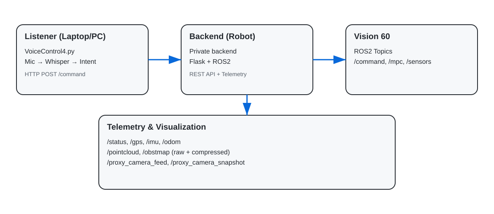

# Voice Control for Vision 60

Voice Control records a short microphone sample, transcribes speech locally with OpenAI Whisper, maps recognized phrases to robot intents, and sends commands to a Flask + ROS2 bridge.

No OpenAI API key is required: this project uses the locally installed open-source Whisper model.

## Demo video

[Watch the Vision 60 Voice Control demo (MP4)](https://github.com/jd702/VoiceControl/releases/download/demo-2026-08/VoiceControl_Demo.mp4)

The demonstration shows local speech recognition driving Vision 60 commands.
It is published as a browser-compatible H.264/AAC
[GitHub Release asset](https://github.com/jd702/VoiceControl/releases/tag/demo-2026-08)
with source device and location metadata removed.

## Capabilities

- Forward and backward movement with spoken durations
- Left and right turns
- Stop, sit, stand, and walk actions
- Manual-mode command
- Number and number-word duration parsing
- Optional local text-to-speech feedback
- Automatic manual/walk priming before the first movement command

## Architecture



Detailed architecture:

- [High-Level System Architecture](docs/HSLA.md)
- [Endpoint overview](docs/images/endpoints.svg)

## Quick start

```bash
python3 -m venv .venv
source .venv/bin/activate
python -m pip install --upgrade pip
pip install -r requirements.txt
export VOICE_FLASK_API=http://ROBOT_HOST:5002
python3 VoiceControl4.py
```

Replace `ROBOT_HOST` locally. Never commit the real robot address.

See [INSTALLATION.md](INSTALLATION.md) for operating-system audio dependencies and backend checks.

## Supported phrases

- `forward for 3 seconds`
- `backward two seconds`
- `turn left for five seconds`
- `turn right`
- `sit`
- `stand`
- `walk`
- `stop`
- `enter manual mode`

If no duration is provided, movement defaults to one second.

## Configuration

| Variable or setting | Purpose | Default |
| --- | --- | --- |
| `VOICE_FLASK_API` | Robot Flask + ROS2 API base URL | `http://127.0.0.1:5002` |
| `ENABLE_TTS` | Enable listener-side spoken feedback | `False` |
| Whisper model | Accuracy/speed tradeoff | `base` |

## Safety

- Validate E-stop independently before testing voice movement.
- Begin in simulation, dry-run tooling, or a secured robot area.
- Keep the robot API on a trusted network and require server-side authorization for production use.
- Review [docs/SECURITY.md](docs/SECURITY.md) before publishing changes.

## Repository scope

This public repository contains the voice listener and documentation. Robot-side backend implementation and deployment-specific configuration are intentionally excluded.

## Troubleshooting

- Backend unreachable: `curl "$VOICE_FLASK_API/status"`
- Microphone errors: verify OS microphone permissions and PyAudio/PortAudio installation.
- Slow transcription: select a smaller Whisper model such as `tiny`.
- Poor recognition: verify input gain and reduce background noise.
