# High-Level System Architecture (HSLA)

```mermaid
flowchart LR
  Speaker[Operator speech] --> Mic[Microphone / PyAudio]
  Mic --> WAV[Short WAV recording]
  WAV --> Whisper[Local Whisper ASR]
  Whisper --> Parser[Intent and duration parser]
  Parser --> Safety[Mode and action priming]
  Safety --> HTTP[HTTP command client]
  HTTP --> Bridge[Private Flask + ROS2 bridge]
  Bridge --> Topics[Vision 60 ROS2 topics]
  Topics --> Robot[Robot motion or action]
```

## Components

### Audio capture

PyAudio records mono PCM audio to a temporary WAV file. The listener runs continuously and processes one short command window at a time.

### Local speech recognition

Whisper runs on the listener computer and returns text. This is local model inference and does not require an OpenAI API key.

### Intent parser

The parser recognizes stop, action, mode, direction, and duration phrases. It produces a small command object instead of forwarding arbitrary transcribed text to the robot.

### Robot API client

The client sends structured JSON to the robot-side bridge configured through `VOICE_FLASK_API`. Before the first movement command, it requests manual control mode and the walk action.

### ROS2 bridge

The bridge is outside this public repository. It validates the request, publishes to the appropriate ROS2 command topic, and owns robot-side authorization and safety enforcement.

## Trust boundaries

- Microphone audio and transcripts remain on the listener unless external logging is added.
- The robot endpoint is deployment configuration and must not be committed.
- The public listener must not contain backend credentials, private addresses, or robot-side implementation details.
- E-stop and physical safety controls must remain independent of speech recognition.
